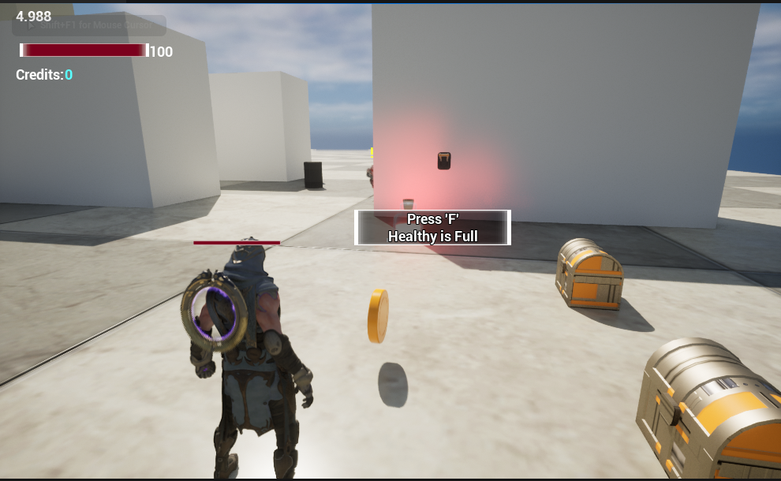
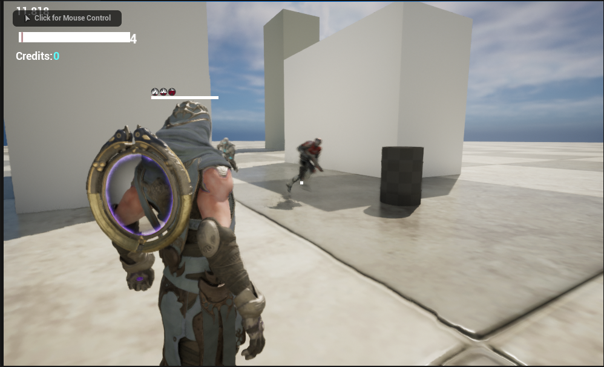
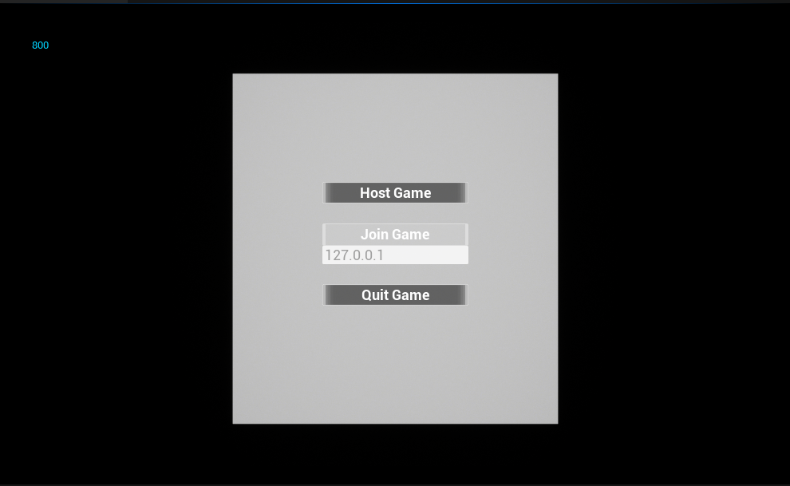

### 游戏内容

- 玩家人物
    1. 拥有自定义血条组件
    2. 拥有GAS组件
    3. 拥有基本行动
    4. UMG界面
- AI人物
    1. 自定义行为树
       - 血量低，自动回血 
       - 自动寻找玩家
       - 自动攻击玩家
    2. 拥有自定义血条组件
    3. 拥有GAS组件
    4. 发现玩家UMG界面
- GAS游戏能力系统：
    1. 火球发射
    2. 奔跑（自定义动画）
    3. 反弹
    4. 火球燃烧
    5. 黑洞投射物
    6. 位移投射物
- 游戏物品（可交互）
    1. 血瓶（添加血量，需要分数）
    2. 金币（添加分数）
    3. 宝箱
    4. 汽油桶
- UMG
    1. 玩家血条（自定义材质），分数，游戏时间
    2. 主界面，暂停界面
- 其他
    1. 支持局域网联机  
    ...
### 游戏画面

### AI及状态

### 界面

